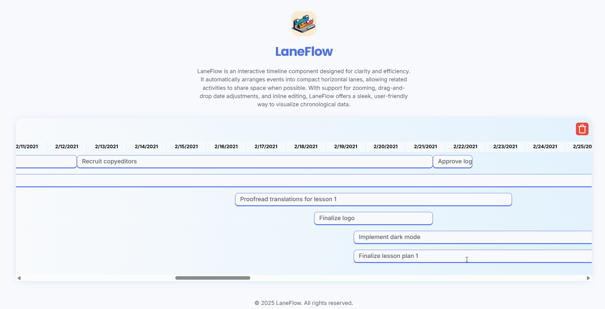

<h1 align="right">
  
  LaneFlow ⏲️
</h1>

<p align="right">
  A simple timeline component for visualizing events in a compact and accessible way.
</p>

<br/>

## Overview



This project is a React + TypeScript + Vite implementation of a compact, accessible timeline component. It visualizes events in horizontal lanes, efficiently packing items to minimize space while ensuring event names are readable and responsive.

## What I Like About My Implementation

- **Accessibility:** All interactive components include ARIA attributes and keyboard navigation for screen reader support.
- **User Experience:** Features like zooming, inline editing, and clearing changes make the timeline interactive and intuitive.
- **Maintainability:** The code is modular, with clear separation of concerns and reusable components.

## What I Would Change Next Time

- **Drag & Drop:** Add robust drag-and-drop support for changing event dates directly on the timeline.
- **Animations:** Smooth transitions for lane assignment and item movement would enhance the experience.
- **Testing:** Integrate automated accessibility and UI tests for reliability.
- **Performance:** Optimize rendering for very large datasets.
- **Responsiveness:** Timeline items adapt their font size and layout to fit event names, using container queries.
- **Zoom:** Implement a zoom feature to allow users to adjust the timeline view.

## Design Decisions & Inspiration

- **Compact Lane Packing:** Used a custom lane assignment algorithm to minimize vertical space, inspired by Gantt charts and calendar UIs.
- **Visual Identity:** All colors and fonts use project-wide CSS variables for consistency.
- **Accessibility:** Followed WAI-ARIA guidelines and referenced accessible React component libraries for best practices.

## How I Would Test With More Time

- **Unit Tests:** For lane assignment, date calculations, and component logic.
- **Accessibility Audits:** Using tools like axe and Lighthouse.
- **Cross-Browser Testing:** Ensure consistent behavior and appearance.
- **Responsiveness:** Container queries and CSS clamp ensure timeline items look good at any zoom level or screen size.

## Getting Started

1. **Install dependencies:**

  ```sh
  npm i
  ```

2. **Start the development server:**

  ```sh
  npm run dev
  ```

3. **Open your browser:**
  Visit `http://localhost:5173` (or the port shown in your terminal).

The timeline will render sample data from `public/mock-data.json`.

## File Structure

- `src/modules/timeline/` — Main timeline logic and layout
- `src/components/timeline/` — Timeline UI components (header, item, zoom, clear)
- `src/services/lanes-service/` — Local storage and lane assignment utilities
- `src/shared/utils/` — Date utilities

## License

This project is under the MIT license. Take a look at the [LICENSE](LICENSE) file for more details.

## Contribute

1. Fork this repository
2. Create a branch with your feature: `git checkout -b my-feature`
3. Commit your changes: `git commit -m 'feat: My new feature'`
4. Push your branch: `git push origin my-feature`
